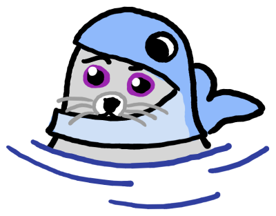

<!-- markdownlint-disable-next-line MD022 -->
# Sealwatcher


[](https://pkg.go.dev/github.com/thediveo/sealwatcher)
[](https://img.shields.io/github/license/thediveo/sealwatcher)


[](https://goreportcard.com/report/github.com/thediveo/sealwatcher)

`sealwatcher` adds [Podman](https://podman.io) support to
[@thediveo/whalewatcher](https://github.com/thediveo/whalewatcher) in order to
track the list of containers (name, PID, project, pod) without constant polling
and without the hassle of event "binge processing".

Please note: because building the Podman REST API client requires a considerable
amount of C libraries as well as header files to be installed in the build
system, `sealwatcher` isn't an integral part of the `whalewatcher` module so
far. If at some future point the Podman project improves the situation so that
Podman REST API clients can be built without the huge installation overhead,
then `sealwatcher` might be finally integrated into `whalewatcher`.

## Installation

First, install the non-Go stuff the Podman module insists of having available,
even if it is totally unnecessary for a REST API client. The following is
basically the Debian/Ubuntu package list from [Podman's "Building from
scratch"](https://podman.io/getting-started/installation#building-from-scratch)
instructions, sans the packages that are either already installed (Go) or are
chosen by the builder anyway, such as `docker-ce` versus `docker.io`:

```bash
sudo apt-get install \
  btrfs-progs go-md2man iptables libassuan-dev libbtrfs-dev libc6-dev libdevmapper-dev \
  libglib2.0-dev libgpgme-dev libgpg-error-dev libprotobuf-dev libprotobuf-c-dev \
  libseccomp-dev libselinux1-dev libsystemd-dev pkg-config runc uidmap
```

In order to use `sealwatcher` as a depency in your own Go modules, you first
need to pin the `cni` module version and then `go get` the `sealwatcher` module.

```bash
# make sure to pin the containernetworking/cni module dependency!
go get github.com/containernetworking/cni@v0.8.1
go get github.com/thediveo/sealwatcher
```

## Supported Go Versions

`sealwatcher` supports versions of Go that are noted by the [Go release
policy](https://golang.org/doc/devel/release.html#policy), that is, _N_ and
_N_-1 major versions.

## Miscellaneous

- to view the package documentation _locally_:
  - either: `make pkgsite`,
  - or, in VSCode (using the VSCode-integrated simple browser): “Tasks: Run
    Task” ⇢ “View Go module documentation”.
- `make` shows the available make targets.

## Hacking It

This project comes with comprehensive unit tests, even covering goroutine and
file descriptor leak checks:

* goroutine leak checking courtesy of Gomega's
  [`gleak`](https://onsi.github.io/gomega/#codegleakcode-finding-leaked-goroutines)
  package.

* file descriptor leak checking courtesy of the
  [@thediveo/fdooze](https://github.com/thediveo/fdooze) module.

> **Note:** do **not run parallel tests** for multiple packages. `make test`
ensures to run all package tests always sequentially, but in case you run `go
test` yourself, please don't forget `-p 1` when testing multiple packages in
one, _erm_, go.

## Copyright and License

Copyright 2022 Harald Albrecht, licensed under the Apache License, Version 2.0.
